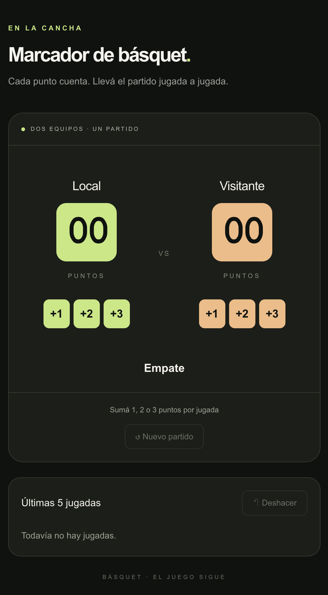

# tarea asincronica de marcador de basquet

Marcador de básquet creado con React, TypeScript y Vite.

## Para ejecutar

npm install
npm run dev

## Respuestas del Ejercicio 2
El estado vive en el padre porque necesita controlar los dos puntajes y reiniciarlos juntos con "nuevo partido".
PanelEquipo recibe el puntaje por props y avisa cuantos puntos sumar, sin conocer el equipo.
Cada boton recibe onPress={() => onAnotar(valor)} para enviar los puntos correspondientes al hacer clic.
No alcanza con onPress={onAnotar} porque onPress no pasa argumentos y onAnotar necesita un numero.

## Capturas

